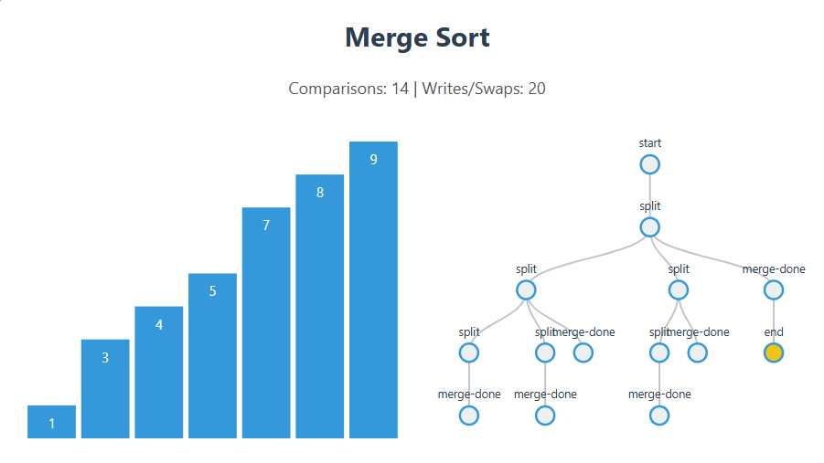
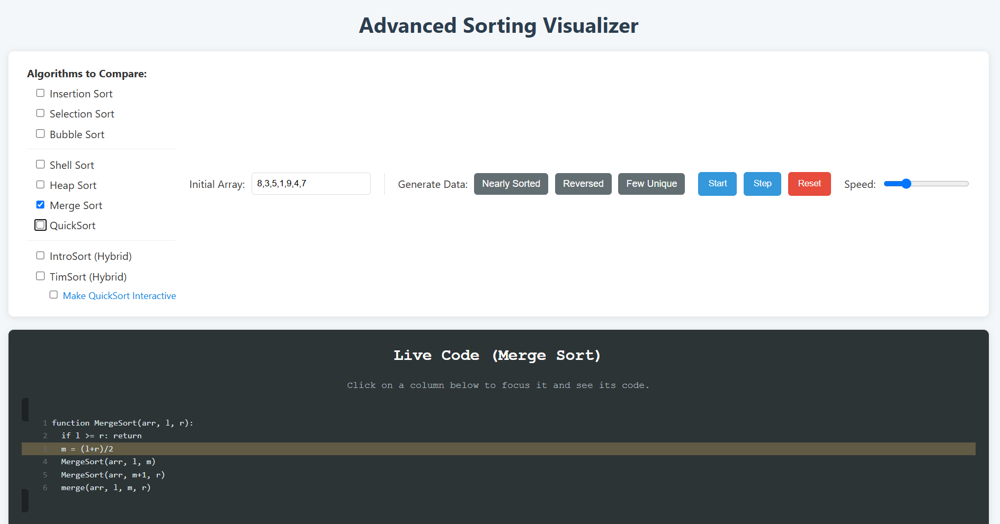

# Sorting Decision Tree Visualizer

An interactive web application that visualizes the decision-making process of various sorting algorithms using D3.js.

**[View the Live Project Here!]( https://sinchanarv.github.io/Sorting-Decision-Tree-Visualizer/)**
*(Note: This link will work after completing Step 2 below)*





## About This Project

This project was created to demystify the operational flow of fundamental sorting algorithms. It provides a dynamic, graphical representation of an algorithm's execution path as a decision tree, making abstract concepts like comparisons, swaps, and recursion tangible and easy to follow.

### Key Features:
*   **Dynamic Visualization:** Watch algorithms sort an array in real-time.
*   **Decision Tree Generation:** See the entire decision process mapped out as a tree, clearly showing the difference between linear and recursive algorithms.
*   **Multiple Algorithms:** Compare Bubble Sort, Selection Sort, Insertion Sort, and QuickSort.
*   **Interactive Controls:** Control the animation with start, step, and reset buttons, and an adjustable speed slider.
*   **Efficiency Metrics:** View live counts of comparisons and swaps to understand algorithmic efficiency.

## Built With

*   HTML5
*   CSS3
*   JavaScript (ES6+)
*   **D3.js (v7)** - The core library for all data-driven visualizations.

## How to Run Locally

1.  Clone the repository:
    ```sh
    git clone  https://sinchanarv.github.io/Sorting-Decision-Tree-Visualizer/
    ```
2.  Navigate to the project directory:
    ```sh
    cd Sorting-Decision-Tree-Visualizer
    ```
3.  Open `index.html` in your web browser (using a tool like VS Code's "Live Server" is recommended).